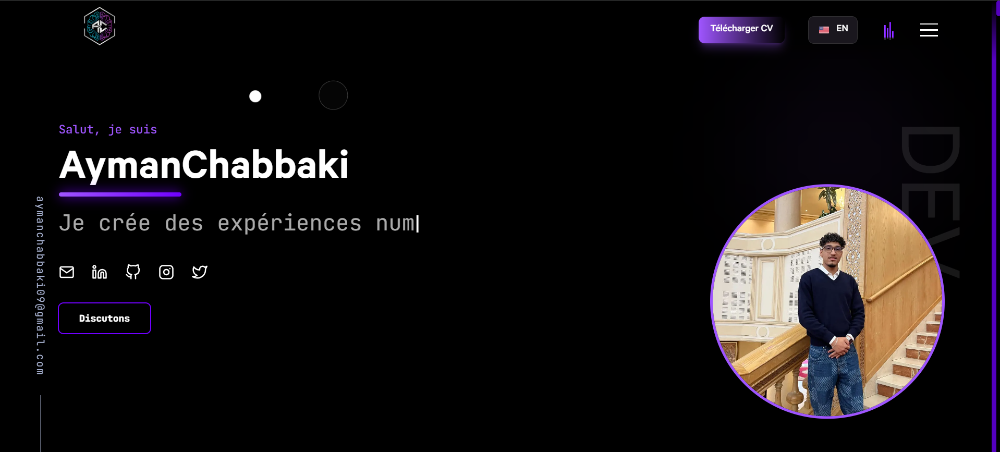

# 🚀 Devfolio - Modern Developer Portfolio

<p align="center">
  
</p>

<p align="center">
  
  
  
  
  
</p>

> A modern, interactive, and feature-rich developer portfolio built with Next.js, featuring advanced analytics, AI integrations, and stunning animations. Perfect for developers who want to showcase their work with style! ✨

---

## 📋 Table of Contents

- [Features](#-features)
- [Tech Stack](#-tech-stack)
- [Getting Started](#-getting-started)
- [Project Structure](#-project-structure)
- [Configuration](#-configuration)
- [Analytics Dashboard](#-analytics-dashboard)
- [Environment Variables](#-environment-variables)
- [Deployment](#-deployment)
- [Customization](#-customization)
- [License](#-license)

---

## ✨ Features

### 🎨 **Core Features**
- **Responsive Design** - Fully optimized for mobile, tablet, and desktop
- **Dark Mode** - Elegant dark theme with smooth transitions
- **Smooth Animations** - GSAP-powered scroll animations and Framer Motion interactions
- **Multi-language Support** - French/English language toggle
- **SEO Optimized** - Meta tags, Open Graph, and Twitter Cards

### 🤖 **Interactive Components**
- **AI Chatbot** - Floating interactive chatbot with:
  - Section-aware contextual messages
  - Random playful movements
  - Ball-like drag physics with momentum
  - Bilingual support (French/English)
  - Click-to-navigate feedback feature
  
- **Scroll-to-Top Button** - Smooth scroll with:
  - Auto-show/hide on scroll
  - 360° rotation animation
  - Gradient styling with hover effects

### 📊 **Analytics Dashboard** (`/hidden`)
Advanced analytics dashboard with password protection featuring:
- **Real-time Metrics**
  - Active visitors counter
  - Live activity feed
  - Hourly traffic patterns (24h)
  - Entry/Exit page tracking

- **Performance Monitoring**
  - Core Web Vitals (LCP, FID, CLS)
  - Load time analytics
  - Error tracking with alerts
  - Bounce rate monitoring

- **Traffic Analysis**
  - Traffic trends (line charts)
  - Device breakdown (mobile/desktop/tablet)
  - Browser statistics
  - Geographic data (countries & cities)
  - Traffic sources (direct, social, search)

- **User Engagement**
  - Contact form submissions with **clickable email addresses**
  - User feedback with star ratings
  - Session duration analytics
  - Pages per session metrics

- **Data Export**
  - JSON export functionality
  - Complete analytics data download
  - Contact email list export

### 📝 **Sections**
1. **Hero** - Animated introduction with typed strings
2. **Skills** - Tech stack showcase with icons
3. **Projects** - Interactive project cards with filters
4. **Work Experience** - Timeline with smooth scroll animations
5. **Contact** - Form with EmailJS integration
6. **Feedback** - User feedback system with star ratings and flash animation

### 🎯 **Additional Features**
- **Sound Effects** - Interactive audio feedback on user actions
- **Confetti Animations** - Celebration effects with canvas-confetti
- **Konami Code Easter Egg** - Hidden rainbow animation
- **Cursor Effects** - Custom cursor with trail effects
- **Progress Indicator** - Reading progress bar
- **Lottie Animations** - Smooth vector animations in footer
- **Form Validation** - Bad words filter and comprehensive validation
- **Toast Notifications** - React Hot Toast for user feedback

---

## 🛠️ Tech Stack

### **Frontend**
- **[Next.js 16.1.6](https://nextjs.org/)** - React framework with SSR/SSG
- **[React 18.2.0](https://react.dev/)** - UI library
- **[Framer Motion](https://www.framer.com/motion/)** - Advanced animations
- **[GSAP](https://greensock.com/gsap/)** - Professional-grade animations
- **[Tailwind CSS](https://tailwindcss.com/)** - Utility-first CSS framework
- **[Sass](https://sass-lang.com/)** - CSS preprocessor

### **UI Components & Icons**
- **[React Icons](https://react-icons.github.io/react-icons/)** - Icon library
- **[Recharts](https://recharts.org/)** - Chart library for analytics
- **[Typed.js](https://mattboldt.com/demos/typed-js/)** - Typing animation
- **[Lottie Web](https://airbnb.io/lottie/)** - Animation library

### **Backend & Database**
- **[Supabase](https://supabase.com/)** - PostgreSQL database & authentication
- **Next.js API Routes** - Serverless API endpoints

### **Analytics & Tracking**
- **[Google Analytics](https://analytics.google.com/)** - GA4 integration
- **[Vercel Analytics](https://vercel.com/analytics)** - Real-time web analytics
- **Custom Analytics System** - Advanced tracking with Supabase

### **Forms & Communication**
- **[EmailJS](https://www.emailjs.com/)** - Email sending service
- **[React Hot Toast](https://react-hot-toast.com/)** - Notification system

### **Utilities**
- **[Canvas Confetti](https://www.kirilv.com/canvas-confetti/)** - Celebration effects
- **[Howler.js](https://howlerjs.com/)** - Audio library
- **[Bad Words](https://github.com/web-mech/badwords)** - Profanity filter
- **[UUID](https://github.com/uuidjs/uuid)** - Unique ID generation
- **[JS Cookie](https://github.com/js-cookie/js-cookie)** - Cookie management
- **[Vanilla Tilt](https://micku7zu.github.io/vanilla-tilt.js/)** - 3D tilt effect

---

## 🚀 Getting Started

### Prerequisites
- **Node.js** 18.x or higher
- **npm**, **yarn**, **pnpm**, or **bun** package manager
- **Supabase Account** (for analytics and database)
- **EmailJS Account** (for contact form)

### Installation

1. **Clone the repository**
```bash
git clone https://github.com/yourusername/devfolio.git
cd devfolio
```

2. **Install dependencies**
```bash
# Using npm
npm install

# Using yarn
yarn install

# Using pnpm
pnpm install

# Using bun
bun install
```

3. **Set up environment variables**

Create a `.env.local` file in the root directory:

```env
# Supabase Configuration
NEXT_PUBLIC_SUPABASE_URL=your_supabase_url
NEXT_PUBLIC_SUPABASE_ANON_KEY=your_supabase_anon_key

# EmailJS Configuration
NEXT_PUBLIC_EMAILJS_SERVICE_ID=your_service_id
NEXT_PUBLIC_EMAILJS_TEMPLATE_ID=your_template_id
NEXT_PUBLIC_EMAILJS_PUBLIC_KEY=your_public_key

# Google Analytics
NEXT_PUBLIC_GA_MEASUREMENT_ID=your_ga_measurement_id

# Dashboard Authentication
DASHBOARD_PASSWORD=your_secure_password
```

4. **Set up Supabase Database**

Create the following tables in your Supabase project:

```sql
-- Page Views Table
CREATE TABLE page_views (
  id UUID PRIMARY KEY DEFAULT uuid_generate_v4(),
  visitor_id UUID NOT NULL,
  page_path TEXT NOT NULL,
  referrer TEXT,
  utm_source TEXT,
  utm_medium TEXT,
  country TEXT,
  city TEXT,
  device_type TEXT,
  browser TEXT,
  created_at TIMESTAMP WITH TIME ZONE DEFAULT NOW()
);

-- Sessions Table
CREATE TABLE sessions (
  id UUID PRIMARY KEY DEFAULT uuid_generate_v4(),
  visitor_id UUID NOT NULL,
  is_new_visitor BOOLEAN DEFAULT false,
  entry_page TEXT,
  exit_page TEXT,
  duration INTEGER,
  page_count INTEGER,
  bounce BOOLEAN DEFAULT false,
  start_time TIMESTAMP WITH TIME ZONE DEFAULT NOW(),
  end_time TIMESTAMP WITH TIME ZONE
);

-- Events Table
CREATE TABLE events (
  id UUID PRIMARY KEY DEFAULT uuid_generate_v4(),
  visitor_id UUID NOT NULL,
  event_type TEXT NOT NULL,
  event_data JSONB,
  created_at TIMESTAMP WITH TIME ZONE DEFAULT NOW()
);

-- Performance Metrics Table
CREATE TABLE performance_metrics (
  id UUID PRIMARY KEY DEFAULT uuid_generate_v4(),
  visitor_id UUID NOT NULL,
  lcp NUMERIC,
  fid NUMERIC,
  cls NUMERIC,
  load_time INTEGER,
  created_at TIMESTAMP WITH TIME ZONE DEFAULT NOW()
);

-- Errors Table
CREATE TABLE errors (
  id UUID PRIMARY KEY DEFAULT uuid_generate_v4(),
  visitor_id UUID,
  error_message TEXT,
  stack_trace TEXT,
  created_at TIMESTAMP WITH TIME ZONE DEFAULT NOW()
);

-- Feedbacks Table
CREATE TABLE feedbacks (
  id UUID PRIMARY KEY DEFAULT uuid_generate_v4(),
  name TEXT NOT NULL,
  feedback TEXT NOT NULL,
  rating INTEGER CHECK (rating >= 1 AND rating <= 5),
  created_at TIMESTAMP WITH TIME ZONE DEFAULT NOW()
);
```

5. **Run the development server**
```bash
npm run dev
# or
yarn dev
# or
pnpm dev
# or
bun dev
```

6. **Open your browser**

Navigate to [http://localhost:3000](http://localhost:3000)

---

## 📁 Project Structure

```
devfolio/
├── components/              # React components
│   ├── About/              # About section components
│   ├── Button/             # Reusable button component
│   ├── Collaboration/      # Collaboration section
│   ├── Contact/            # Contact form with mailer
│   ├── Cursor/             # Custom cursor effect
│   ├── Feedback/           # User feedback system
│   ├── Footer/             # Footer with animations
│   ├── Header/             # Navigation header
│   ├── Hero/               # Hero section
│   ├── Icons/              # Icon components
│   ├── Loader/             # Loading animation
│   ├── Meta/               # SEO meta tags
│   ├── Profiles/           # Social profiles
│   ├── ProgressIndicator/  # Scroll progress bar
│   ├── Projects/           # Projects showcase
│   ├── ScrollingChatbot/   # Interactive AI chatbot
│   ├── ScrollToTop/        # Scroll-to-top button
│   ├── Skills/             # Skills section
│   └── Work/               # Work experience timeline
├── contexts/               # React context providers
│   └── LanguageContext.js  # Multi-language support
├── hooks/                  # Custom React hooks
│   ├── useConfetti.js      # Confetti animations
│   ├── useKonamiCode.js    # Easter egg
│   ├── usePortfolioAnalytics.js  # Analytics tracking
│   └── useSoundEffects.js  # Audio management
├── pages/                  # Next.js pages
│   ├── api/                # API routes
│   │   ├── analytics/      # Analytics endpoints
│   │   ├── dashboard/      # Dashboard auth
│   │   └── feedback/       # Feedback API
│   ├── _app.js            # App wrapper
│   ├── _document.js       # Document structure
│   ├── 404.js             # Custom 404 page
│   ├── hidden.js          # Analytics dashboard
│   └── index.js           # Home page
├── public/                 # Static assets
│   ├── favicons/          # Favicon files
│   ├── fonts/             # Custom fonts
│   ├── lottie/            # Lottie animations
│   ├── projects/          # Project images
│   ├── skills/            # Skill icons
│   └── sounds/            # Sound effects
├── styles/                 # Global styles
│   └── globals.scss       # Global SCSS
├── utils/                  # Utility functions
│   ├── cn.js              # Class name utility
│   └── log.js             # Logging utility
├── constants.js            # App constants & config
├── next.config.mjs        # Next.js configuration
├── tailwind.config.js     # Tailwind CSS config
└── package.json           # Dependencies

```

---

## ⚙️ Configuration

### Update Personal Information

Edit `constants.js` to customize:

```javascript
export const METADATA = {
  author: "Your Name",
  title: "Portfolio | Your Name",
  description: "Your description",
  siteUrl: "https://yourdomain.com/",
  twitterHandle: "@yourhandle",
  keywords: ["Your", "Keywords", "Here"].join(", "),
  image: "https://yourdomain.com/preview.png",
};

export const SOCIAL_LINKS = [
  { name: "mail", url: "mailto:your@email.com" },
  { name: "linkedin", url: "https://linkedin.com/in/yourprofile" },
  { name: "github", url: "https://github.com/yourusername" },
  // ... more links
];
```

### Configure Analytics Dashboard

1. Set dashboard password in `.env.local`:
```env
DASHBOARD_PASSWORD=your_secure_password
```

2. Update admin email in `pages/hidden.js`:
```javascript
const [adminEmail] = useState('your@email.com');
```

3. Access dashboard at: `https://yourdomain.com/hidden`

---

## 📊 Analytics Dashboard

### Features
- **Password Protected** - Secure access with session management
- **Real-time Updates** - Auto-refresh every 30 seconds
- **Time Range Filters** - View data for 24h, 7d, 30d, or 90d
- **Export Data** - Download complete analytics as JSON

### Metrics Tracked
- Total visitors & page views
- New vs returning visitors
- Session duration & bounce rate
- Device breakdown (mobile/desktop/tablet)
- Browser statistics
- Geographic data (countries & cities)
- Traffic sources (direct, social, search)
- Core Web Vitals (LCP, FID, CLS)
- User feedback & contact submissions

### Contact Email Display
The dashboard displays all contact form submissions with:
- **Clickable email addresses** - Direct mailto links
- Visitor name and timestamp
- Message preview
- Sortable and filterable list

---

## 🔐 Environment Variables

Create `.env.local` file:

```env
# Required
NEXT_PUBLIC_SUPABASE_URL=your_supabase_project_url
NEXT_PUBLIC_SUPABASE_ANON_KEY=your_supabase_anon_key
NEXT_PUBLIC_EMAILJS_SERVICE_ID=your_emailjs_service_id
NEXT_PUBLIC_EMAILJS_TEMPLATE_ID=your_emailjs_template_id
NEXT_PUBLIC_EMAILJS_PUBLIC_KEY=your_emailjs_public_key

# Optional
NEXT_PUBLIC_GA_MEASUREMENT_ID=your_google_analytics_id
DASHBOARD_PASSWORD=your_dashboard_password
```

### Getting API Keys

**Supabase:**
1. Sign up at [supabase.com](https://supabase.com)
2. Create a new project
3. Go to Settings > API
4. Copy Project URL and anon/public key

**EmailJS:**
1. Sign up at [emailjs.com](https://www.emailjs.com)
2. Create an email service
3. Create an email template
4. Copy Service ID, Template ID, and Public Key

**Google Analytics:**
1. Create account at [analytics.google.com](https://analytics.google.com)
2. Set up GA4 property
3. Copy Measurement ID

---

## 🚢 Deployment

### Deploy on Vercel (Recommended)

[](https://vercel.com/new)

1. Push code to GitHub
2. Import project in Vercel
3. Add environment variables
4. Deploy!

### Deploy on Netlify

[](https://app.netlify.com/start)

1. Connect your repository
2. Build command: `npm run build`
3. Publish directory: `.next`
4. Add environment variables

### Manual Deployment

```bash
# Build the project
npm run build

# Start production server
npm run start
```

---

## 🎨 Customization

### Change Colors

Edit `tailwind.config.js`:

```javascript
module.exports = {
  theme: {
    extend: {
      colors: {
        'indigo-light': '#a78bfa',
        'purple-500': '#c084fc',
        // Add your colors
      },
    },
  },
};
```

### Add New Sections

1. Create component in `components/YourSection/`
2. Import in `pages/index.js`
3. Add section to `MENULINKS` in `constants.js`

### Modify Chatbot Messages

Edit `components/ScrollingChatbot/ScrollingChatbot.js`:

```javascript
const messages = {
  fr: {
    home: <><HiHome /> Votre message!</>,
    // ... other messages
  },
  en: {
    home: <><HiHome /> Your message!</>,
    // ... other messages
  }
};
```

---

## 🤝 Contributing

Contributions are welcome! Please feel free to submit a Pull Request.

1. Fork the repository
2. Create your feature branch (`git checkout -b feature/AmazingFeature`)
3. Commit your changes (`git commit -m 'Add some AmazingFeature'`)
4. Push to the branch (`git push origin feature/AmazingFeature`)
5. Open a Pull Request

---

## 📄 License

This project is **MIT licensed**. You can use it for personal or commercial projects.

### Attribution

While not required, I'd appreciate if you:
- Keep the footer attribution
- Star the repository ⭐
- Share your portfolio with me!

---

## 🙏 Acknowledgments

- Design inspired by modern portfolio trends
- Icons from [React Icons](https://react-icons.github.io/react-icons/)
- Animations powered by [GSAP](https://greensock.com/) and [Framer Motion](https://www.framer.com/motion/)
- Database and auth by [Supabase](https://supabase.com/)

---

## 📬 Contact

**Ayman Chabbaki**
- Email: aymanchabbaki09@gmail.com
- LinkedIn: [linkedin.com/in/ayman-chabbaki](https://www.linkedin.com/in/ayman-chabbaki/)
- GitHub: [@AymanChabbaki](https://github.com/AymanChabbaki)
- Twitter: [@aymen_exe777](https://x.com/aymen_exe777)

---

## ⭐ Star History

If you found this project helpful, please consider giving it a star!

[](https://star-history.com/#shubh73/devfolio&Date)

---

<p align="center">
  Made with ❤️ by <a href="https://github.com/AymanChabbaki">Ayman Chabbaki</a>
</p>

<p align="center">
  <sub>Built with Next.js • Deployed on Vercel</sub>
</p>
